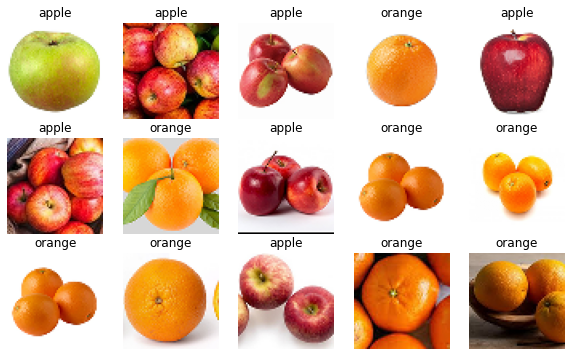
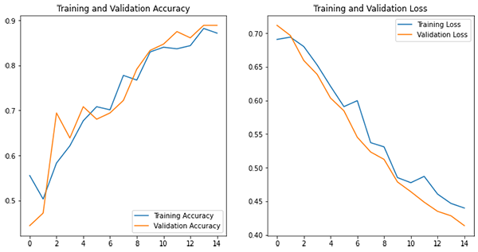
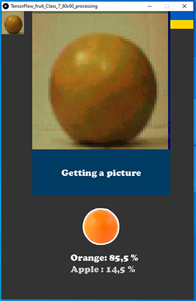

### Clasificación de imágenes con TensorFlow y Arduino

Este repositorio contiene código que permite deducir la clasificación de imágenes de dos tipos de frutas: manzanas y naranjas. El Modelo se entrenó con imágenes de 60 por 60 pixeles en __Colab__ y se desplegó en un __Arduino DUE__ vinculado a una cámara __OV7670__ con FIFO. Para la implementación se usó __TensorFlow(2.3.0).__

El [notebook](https://github.com/sandroormeno/Classification-TensorFlowLITE-Arduino/blob/0d3c36e608e721dc5f2de2a8becad5b883f04d60/files/fruit_load_files_and%20training%20new%20tf_color%20V5.ipynb) contiene el código de entrenamiento. Inicialmente se indica la instalación de TensorFlow versión 2.3.0 que es compatible con la biblioteca necesaria para implementar el modelo en el entorno de __Arduino__ y sistemas **ARM 32bits (Arduino DUE).**

Los datos están formados por 360 imágenes en color de 120x120 pixeles en dos clases y seleccionadas de google y editadas en __Photoshop__ para mostrar el objetivo centrado (las frutas). Estas son finalmente redimensionadas (con código) a 60x60 y son modificadas con cambio de contraste y saturación aleatoria, además de usar __RandomCrop__ para el proceso de aumentación de datos.



El modelo es muy simple: incluye una capa convolucional, una flatten y dos capas densas. La precisión obtenida alcanza el 94%. Finalmente, el modelo tiene 75,416 parámetros y ocupa casi 79Kbytes después del proceso de cuantización. 

```python
model.add(layers.Conv2D(4, 3, activation='relu', input_shape=(60,60,3)))
model.add(layers.Flatten())
model.add(layers.Dense(6, activation='relu'))
model.add(layers.Dense(num_classes,activation='softmax'))
```



El [sketch](https://github.com/sandroormeno/Classification-TensorFlowLITE-Arduino/blob/0c3441defa973de3bd20a0a98503a8cd36b578dc/files/TensorFlow_fruit_Class_7_60x60/TensorFlow_fruit_Class_7_60x60.ino) de Arduino contiene el código para interpretar el modelo entrenado previamente y capturar imágenes de la cámara __OV7670__ gracias a una versión adaptada (modificación de registros) para obtener imágenes cuadradas de 60x60 pixeles (__QQQVGA__) en formato __rgb565__. 

| __OV7670__ | __Arduino DUE__ |
|:----------:|:---------------:|
| WRST       | 22              |
| RRST       | 23              |
| WEN        | 24              |
| VSYNC      | 25              |
| RCLK       | 26              |
| DO0-DO7    | D35-D28         |

```c++
       0                          784                          784
     0 +----------------------------+----------------------------+------//--
       |                            |                            |
       |         320                  16      320                  16
    10 |            +----------------+           +----------------+
       |            |                |           |                |
       |            |                |           |                |
       |            |     Image 1    |           |     Image 2    |
       |            |     480*480    |           |     480*480    |   (320+480-784=16)
       |            |                |           |                |
       |            |                |           |                |
   490 |            +----------------+           +----------------+
       |                            |                            |
   510 +----------------------------+----------------------------+------//--
                   Frame 1                      Frame 2
                   

  int hStart = 320;
  int hStop = 16; 

  OV7670WriteReg(HSTART, hStart >> 3); 
  OV7670WriteReg(HSTOP, hStop >> 3 );
  OV7670WriteReg(HREF, ((hStop & 0b111) << 3) | (hStart & 0b111)); 
  OV7670WriteReg(VSTRT, 8 >> 2);
  OV7670WriteReg(VSTOP, 488 >> 2 );
  OV7670WriteReg(VREF, ((488 & 0b11) << 2) | (8 & 0b11));
  
```

En esta oportunidad elegí la biblioteca __EloquentTinyML__ versión __0.0.7__ para reconocer el modelo. Las versiones más recientes no tienen soporte para microcontroladores ARM 32bits como el Arduino DUE.

El [sketch](https://github.com/sandroormeno/Classification-TensorFlowLITE-Arduino/blob/0c3441defa973de3bd20a0a98503a8cd36b578dc/files/TensorFlow_fruit_Class_7_60x60_processing/TensorFlow_fruit_Class_7_60x60_processing.pde) de __Processing 3__ tiene el código para la comunicación con el Arduino por medio del puerto serial. Esto permite tomar las fotos y hacer la inferencia. Además, muestra una versión gráfica y resumida de los resultados para efectos didácticos.


